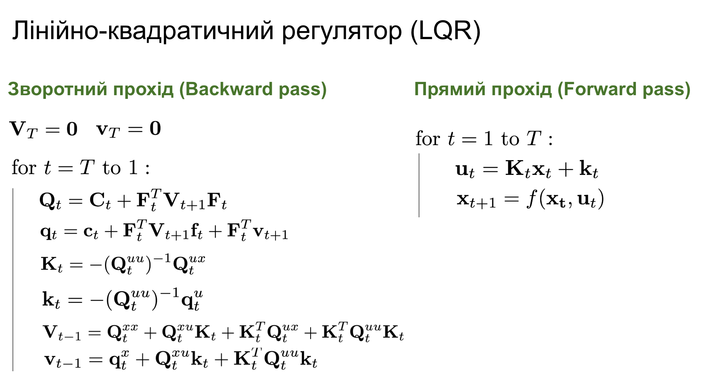
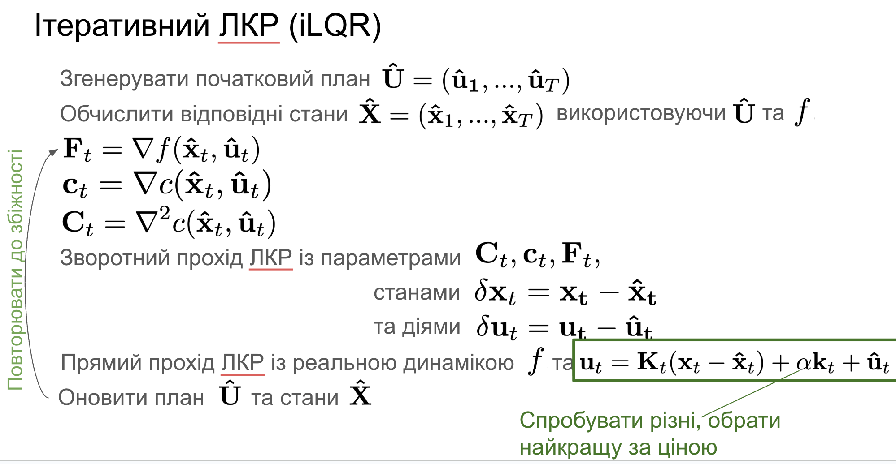

- [Встановлення](#встановлення)
- [Домашнє завдання 1.5 - PID, iLQR та MPC](#домашнє-завдання-15---pid-ilqr-та-mpc)
- [PID](#pid)
- [iLQR](#ilqr)
- [iLQR + MPC](#ilqr--mpc)
- [Рахунок](#рахунок)

# Встановлення
```
pip install -e .
```

# Домашнє завдання 1.5 - PID, iLQR та MPC

В цьому завданні вам потрібно імплементувати три типи котролерів - PID, iLQR та iLQR+MPC.

Спочатку спробуйте запустити програму:
```
python task/balloon.py --human
```

Ви побачите гру, в якій ви можете керувати дроном використовуючи клавіші WASD (W/S - збільшити/зменшити тягу, A/D - нахил вліво/вправо). Задача полягає в тому, щоб збити як можна більше кульок за відведений час.

Якщо ви хочете провести швидкий експеримент, просто додайте `--fast` флаг до командного рядку. Зверніть увагу, що в цьому режимі ви не зможете керувати дроном вручну.

# PID

Щоб додати PID гравця (дрон із PID контролером), додайте флаг `--pid`:
```
python task/balloon.py --pid
```

Propotional Integral Derivative (PID) контролер - це загальний безмодельний контролер, що базується на похибці. Він працює продукуючи сигнал керування як функцію похибки. Ця функція складається з трьох блоків: пропорційоного (`P * error_t`), інтегрального (`I * sum_i=0^t(error_i)`) та диференціального (`D * (error_t - error_[t-1})`). Константи `P`, `I` та `D` підбираються окремо (наприклад вручну).

В цьому завданні, вам потрібно імплементувати PID контролер в `pid_player.py:(class PID)` і каскадний PID контролер в `pid_player.py:(class PIDPlayer)`. Перша частина доволі зрозуміла, а стосовно другої надам опис трохи далі.

Сигнал керування дроном складається з двох компонент - `T_left` та `T_right` (T - thrust/тяга). Фактично вони контролюють струм, що подається на лівий та правий двигуни. Похибка формулюється в термінах пози дрона - позиції та орієнтації. Оскільки наш дрон двовимірний, позиція складається з `x` та `y` координат, а орієнтація - це просто один кут `\theta`. 

Тепер ми бачимо проблему. У нас є три компоненти похибки, а сигнали керування залежать від декількох компонент одночасно. Як же нам сформулювати загальний контролер?

Спочатку, переформулюємо сигнали керування. Тепер ми розглядатимемо не `T_left` та `T_right`, а `T_left - T_right` та `T_left + T_right`. Це має сенс, адже різниця тяг впливає на кут, а сума - на підйомну силу.

Сформулюємо тепер простий PID каскад.

```
Cascade 1:
(y - y_setpoint) -> PID -> y_speed_setpoint
(y_speed - y_speed_setpoint) -> PID -> T_sum
```

У першому каскаді, ми спочатку обчилюємо похибку по Y, подаємо її на вхід PID контролера, що видає setpoint (бажане значення) для швидкості по Y. Далі, цей setpoint використовується для обчислення похибки по швидкості по Y, що потім подається на вхід другого PID контролера, що вже видає сумарну тягу.

```
Cascade 2:
(x - x_setpoint) -> PID -> angle_setpoint
(angle - angle_setpoint) -> PID -> T_diff
```

У другому каскаді, ми спочатку обчилюємо похибку по X, подаємо її на вхід PID контролера, що видає setpoint (бажане значення) для кута. Далі, цей setpoint використовується для обчислення похибки по куту, що потім подається на вхід другого PID контролера, що вже видає різницю тяг.


# iLQR

Щоб додати iLQR гравця (дрон із iLQR контролером), додайте флаг `--ilqr`:
```
python task/balloon.py --ilqr
```

Iterative Linear Quadratic Regulator - це контролер, що базується на моделі динаміки і функції ціни. Він працює з локально-гладкими просторами станів-дій.




Лінійна версія обговорювалась на лекціях. Щодо ітеративної (нелінійної) версії - див [цю статтю (EN)](https://jonathan-hui.medium.com/rl-lqr-ilqr-linear-quadratic-regulator-a5de5104c750), зверніть особливу увагу на псевдокод. Також див [це](https://studywolf.wordpress.com/2016/02/03/the-iterative-linear-quadratic-regulator-method/) та [це](https://www.cs.cornell.edu/courses/cs6756/2022fa/assets/slides_notes/lec6_slides.pdf).

Ваша задача - імплементувати три логічні блоки - `ilqr_player.py:rollout, backward_pass, and forward_pass`. Див `ilqr_player:run_ilqr` для деталей їх використання.


# iLQR + MPC

Щоб додати iLQR+MPC гравця (дрон із iLQR+MPC контролером), додайте флаг `--mpc`:
```
python task/balloon.py --mpc
```

Model Predictive Control (MPC) - це спосіб застосування контролерів, що повертають короткі плани дій.
Ідея така. Скажімо у нас є контролер `A`, який ми застосовуємо в момент часу `t` отримуючи план (послідовність дій) `U=(U_t, ... U_{t+T})` довижини `T`. У випадку з MPC, тільки перша дія з плану (`U_t`) буде застосована, а після цього весь план обчислюється заново вже в моменті часу `t+1`. Цей доволі простий підхід дозволяє адаптуватись до помилок в моделі і несподіваних збурень середовища.
Ця частина повинна бути найпростішою. Все що потрібно зробити, це реалізувати логіку флагу `self.use_mpc` в `ilqr_player.py:iLQRPlayer.act`. Якщо `self.use_mpc` - True, то виконуємо тільки першу дію.

Щоб оцінити переваги MPC, рекомендую спробувати збільшити масу дрону, таким чином, щоб модель динаміки не відповідала дійсності на сто відсотків.
```
python task/balloon.py --mpc --ilqr --fast --mass 2.0
```
Очікується що iLQR буде стрибати на місці, а iLQR+MPC буде працювати все ще доволі ефективно.

# Рахунок
Нарешті, порівняйте рахунок усіх методів. Наприклад, запустіть

```
python task/balloon.py --mpc --ilqr --pid --fast
```

Ось мій рахунок:
```
PID collected : 32
iLQR collected : 75
iLQR_MPC collected : 92

Winner is : iLQR_MPC !
```

Спробуйте підналаштувати параметри різних методів, самі методи тощо. Якщо ваш рахунок перевищує мій бейслайн - обовʼязково вкажіть це при відправці завдання на перевірку!
